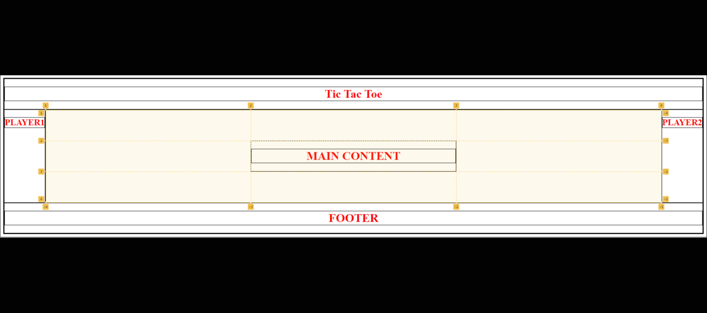

# Space Invaders TicTacToe

This is my version of [TicTacToe](https://waddo4.github.io/Project0---TicTacToe/). I hope you enjoy.

## Technologies used
 - HTML
 - CSS
 - Javascript
 - DOM
## Features

This project includes:

 - A start screen with keyframe styling.
 - A fully function, two player TicTacToe game played on a 3x3 grid designed to represent a classic 4:3 aspect ratio.
 - A score counter for each player.
 - Sound effects on click, on a draw and on wins.
 - A board reset button, colour inversion button, side animation toggle and mute button.
 - A theme designed around the original Space Invaders.
 - Special bonus content when a player is owning.

## Planning & Development

**Layout Planning & Development**  
  

Once the layout was completed, I worked on developing the Javascript to get the game working. First, I worked on toggling the players turns, then getting a function that placed the players image on the grid tile they selected. After revising my click function and changing it to add attirbutes, I started working on implementing the win conditions and draw. Once that was working, I added a board reset, changed the design to have the main content in the middle and two side areas that were purely for aesthetics. Finally I added a button to toggle the side animations, a button invert the colours on the page, added sound effects and a mute button.

## Bugs & Solutions
**BUG**
Player's being able to click on the same square multiple times.  
**SOLUTION**
Adds an attribute to the tile when it's clicked. Cnce that attribute is added, the eventListener ignores that tile.

**BUG**
Colour inversion not working on player images that have been played on grid tiles.  
**SOLUTION**
Create a button toggle for the body which adds the class 'inverted'. Create another selector in CSS which is .inverted .*insertClassHere* so that it only activates when the body has the class 'inverted'.

## Improvement ideas

 - Add bots opponents with varying difficulty levels.
 - Add an option for adjusting the grid size.
 - Add a timer for TicTacToe blitz.
 - Make the board reset button a red UFO the hovers from left-right at the top of the page.
 - Add a bonus feature after (x)wins to change the grid to a fully functioning Space Invaders game. 

## Acknowledgements

Thank you Dido & CJ for all your help and support throughout the project.

---

© Nick Waddington 2022